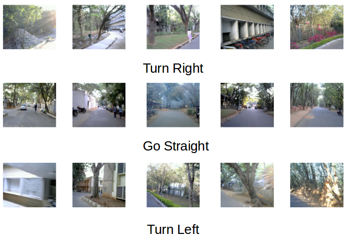

The IISc-RF is labelled dataset accompanying "FeatherNet - A Compressed Neural Network for High Speed, Outdoor Autonomous Navigation of MAVs with Limited Computational Power", currently under review. The data was collected by research staff working at Robert Bosch Centre for Cyber Physical Systems at the Indian Institute of Science.

# IISc-RF dataset

The IISc-RF dataset consists of 60,150 RGB images, each of dimension 49x49, on roads inside the Indian Institute of Science campus. The dataset is split into disjoint training (51,150 images) and test (9,000 images) sets. Each set has equal representation of images from three classes- Turn Left, Go Straight and Turn Right. Furthermore, the images in the test set were collected on separate set of roads than those in training set.

Below are 5 randomly selected examples from each of the three classes:



# Dataset Layouts

## Software requirements

* Ubuntu 16.04
* Python 2.7
* Numpy 1.14.5
* Tensorflow 1.4.1
* Pickle 

## Python version

The training set has ten files named as train_batch_1 to train_batch_10, and the test set has two files test_batch_1 and test_batch_2. Each file is a "pickled" object produced with [pickle]. Below is a python2 routine which will load and return the data in a file:

```python
def load_data(path_to_file):
    pkl_file = open(patj_to_file, "rb")
    data = pickle.load(pkl_file)
    pkl_file.close()
    return data
```

The above routine takes the path to the data file to be loaded as input, and returns the data in the form of a python dictionary object with the following elements:
* **data** - *numpy.ndarray* object of type *np.unit8*. The dimension is *5,115x6,321* for each training dataset file and *4,500x6,321* for each test dataset file.
* **labels** - python list of numbers in range 0-2 corresponding to the three classes, TurnLeft, GoStraight and TurnRight respectively.

## TensorFlow version

The dataset is divided into 5 training tfrecords (train_batch_1.tfrecords, .., train_batch_5.tfrecords) each having 10,230 images and corresponding labels, and 1 test tfrecord (test_batch.tfrecords) having 9,000 images and corresponding labels. The data can be extracted from each tfrecord using the following *_parse_function* routine.

```python
def _parse_function(data):
    features = {"image": tf.FixedLenFeature((), tf.string, default_value=""),\
                  "label": tf.FixedLenFeature((), tf.int64, default_value=0)}
    parsed_features = tf.parse_single_example(data, features)
    image = tf.decode_raw(parsed_features["image"], tf.uint8)
    label = parsed_features["label"]
    return image, label
```

[pickle]: https://docs.python.org/2/library/pickle.html
